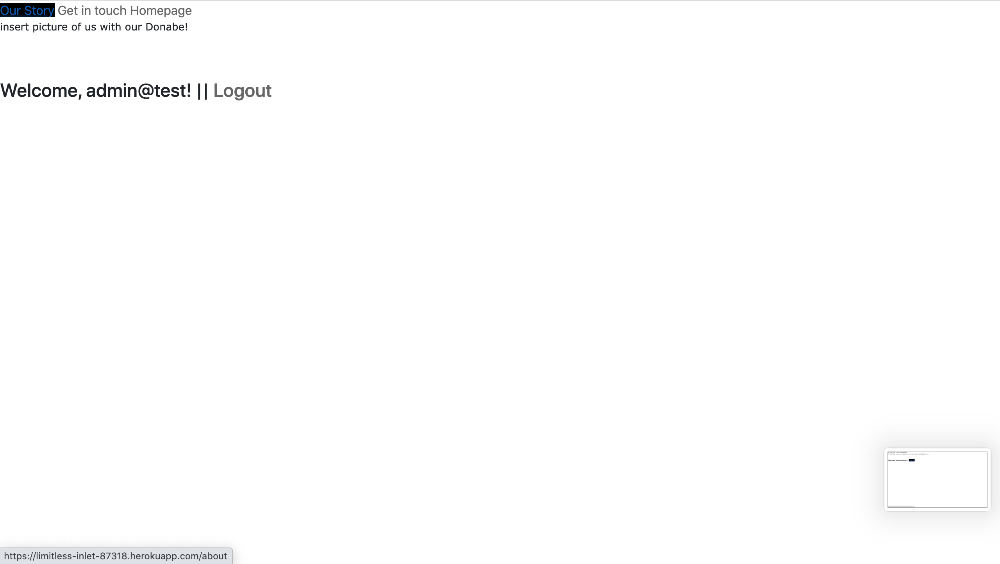
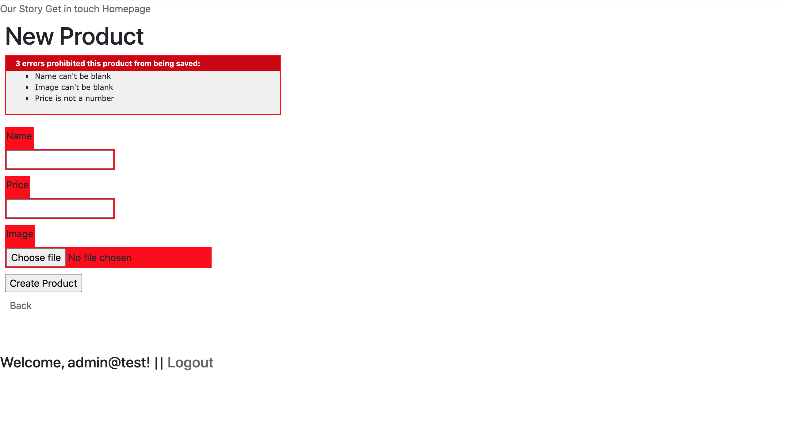

# README

//R7 Identify the problem you are trying to solve:
---

High quality methods of cooking are a key way to improve the health of Australians but the tools required are really hard to source. Often because they are handmade by craftspeople. This application is designed to assist in the acquiring of artisanal tools.

//R8 Why is it a problem that needs solving?
---
WIth nearly two thirds of Australian adults overweight or obese and almost a quarter of Australian children the same, Australia is the fifth fattest nation in the world. Much of the problem is how we regularly cook our foods. Using heavy oils and hydrogenating fats regularly. The reason we cook using heavy oils and hydrogenated fats is because it tastes good. But food can taste excellent without those ingredients if you have access to better cooking methods. This web application is designed to bring hard to source cooking equipment from Japan to everyday consumers by connecting consumers both to a source and furthering the ability to sell second hand Donabes when upgrading.

//R9 URL of deployed website
---
https://limitless-inlet-87318.herokuapp.com/

//R10 Link to GitHub repository
---
https://github.com/securetheb4g/T2A2_samsonblackburn

//R11 Description of the marketplace app:
---
The purpose of this application is to bring artisan cooking equipment to an easy to shop for website and also allow users to sell their second hand equipment to others. Japanese cooking equipment is handmade and difficult to source, this website will take the struggle out of that process.

Functionality / features
---
This is a simple website application that stores product information and non-sensitive user data in a Postrgresql database, Users are able to sign up, sign in and sign out of the application due to utilisation of the Devise Gem. There is a central page for the users to browse the products and the implementation of Stripe to allow user purchases. Users can create their own product listings and purchase the listings of others. The website uses Rolify to distinguish between users and Devise to process the authentication.

Sitemap
---

```
<urlset xmlns="http://www.sitemaps.org/schemas/sitemap/0.9" xmlns:xsi="http://www.w3.org/2001/XMLSchema-instance" xsi:schemaLocation="http://www.sitemaps.org/schemas/sitemap/0.9 http://www.sitemaps.org/schemas/sitemap/0.9/sitemap.xsd">
<!--  created with Free Online Sitemap Generator www.xml-sitemaps.com  -->
<url>
<loc>https://limitless-inlet-87318.herokuapp.com/</loc>
<lastmod>2020-11-19T08:16:22+00:00</lastmod>
<priority>1.00</priority>
</url>
<url>
<loc>https://limitless-inlet-87318.herokuapp.com/about</loc>
<lastmod>2020-11-19T08:16:22+00:00</lastmod>
<priority>0.80</priority>
</url>
<url>
<loc>https://limitless-inlet-87318.herokuapp.com/contact</loc>
<lastmod>2020-11-19T08:16:22+00:00</lastmod>
<priority>0.80</priority>
</url>
<url>
<loc>https://limitless-inlet-87318.herokuapp.com/users/sign_in</loc>
<lastmod>2020-11-19T08:16:22+00:00</lastmod>
<priority>0.80</priority>
</url>
<url>
<loc>https://limitless-inlet-87318.herokuapp.com/users/sign_up</loc>
<lastmod>2020-11-19T08:16:22+00:00</lastmod>
<priority>0.80</priority>
</url>
<url>
<loc>https://limitless-inlet-87318.herokuapp.com/users/password/new</loc>
<lastmod>2020-11-19T08:16:22+00:00</lastmod>
<priority>0.64</priority>
</url>
</urlset>
```

Screenshots
---







Target Audience
---
The target audience are Australians looking for a new way to cook food that better supports their lifestyle.

Tech stack
---
This simple website relies heavily upon the Ruby programming language coupled with the Rails framework. 
Html, CSS, SCSS and Javascript are also used in this website to complement functionality.
Stripe is processing the buyer/seller information and payment authentication.
Postgresql is used to house the database. Balsamiq was utilised to create the wireframes, VisualStudioCode is used to create the readme and access the Markdown format for this readme. 
Heroku has been utilised to deploy the application. Github is the standardised version control system used. 
Cloudinary has been used for image hosting and scaling.
Devise has been used to complete authentication in the application.
Brakeman has been used to check the websites general security.
Rolify has been used to generate the user roles and associations within the application.

//R12 User stories for this app
---
The use cases for this application are very simple. 
There are two different roles: A user (default_role) and an Admin. 

As a User I want to be able to browse the products available, select one to purchase and supply the information needed to create an order so that I can source a Donabe. I also want to be able to sell Donabes of my own when I am looking to upgrade or swap models if mine is not suitable.

As an admin I want to be able to see, update and delete Donabe listings so that I can maintain order of the website.

//R13 Wireframes for this app


//R14 An ERD for this app
---
There are two roles, Buyer and Admin
Roles can have many Users. Which means more than one role may be assigned to a user. In the Users seeded in the database each has a single role.
Users belong to one Role. 
Users can have many products.
Which means a user can purchase or create many products but when creating a product it will only belong to a single User that was logged in to persist the information to the database.
Products belong to one User.
Products can have one ActiveStorage::Attachment which is an image. Which means when a product is created validations ensure only products with images attached can be persisted to the database.The attachment to a product is therefore singular.
Active Storage attachments have one Active Storage Blob. Only one image is uploaded and attached to the activestorage attachment. A single blob is assigned per active storage attachment.


//R15 Explain the different high-level components(abstractions) in this app

#######Discuss MVC Routes etc ####More specific than the workbook question as it needs to relate to the app

This is an MVC Application which means it practices separation of concerns between a Model, View and controller. 

Model: The model is responsible for maintaining the state of the application. The state of a model changes. Sometimes only lasting for a couple of interactions, sometimes permanent, sometimes stored outside the app in a database. This application stores its information in Postgresql. The models used in this app are Users, Products and Roles.

A model represents data and it also enforces business rules that apply to that data. For example: If a discount shouldn't be applied to orders less than $20, the model enforces this constraint. 

View: The view generates the user interface normally based on data in the model. 
For example: An online store has a list of products to be displayed on a catalog screen. The list is accessible via the model but the view acceses the list from the model and formats it for the end user. 

Although the view can present various ways of inputting data, the view itself never handles incoming data.

Many views can access the same model data and for different purposes. 
So a view that displays product info on a catalog page and another set of views used by admin to add and edit products.

The views used in this application are many, the key view categories in this application are Views generated for Devise functionality (Folder Name views/devise), the views necessary for general page navigation (Folder name views/pages) and the views required for product display/editing and purchasing. (Folder name views/products). The key view utilised in the views/layouts folder is application.html.erb it is being used to house the primary page HTML which links between all pages spanning across the application.

Controllers: The controllers orchestrate the application. They receive the events from browser interaction and interact with the model and then the view to display an objective to the user.

The controllers being utilised in this simple app are application_controller, pages_controller and products_controller. The pages controller is being used to link views to the about and contact pages. It is also being used to generate time. The products controller is being used to bring product information from the model so that it can be rendered in the view.


//R16 Detail any third party services the app will use

######Talk about the important gems Devise describe what it is, Bootstrap, Rolify

This application uses the following third party services:

Heroku is a cloud platform that supports Ruby programming language amongst others. It is being used to deploy the Rails application.

Postgresql is an open source relational database mangement system that uses the SQL language.
It is being used to store the database information for the application in a limited way.

Cloudinary is a company that provides cloud based images and video management. It is being used to store and deliver the images used in this website. It is also being used to provide upload functionality for the users.

Github is an online version control system that uses Git. It allows version control and source code management throughout the development of this application.

Boost Note is an open source markdown editor for developers. It has been curcial in the planning and development stages of the application.

Balsamiq is a tool being used to mockup wireframes for the website before development.

Devise is a third party gem allowing flexible authentication for Rails applications. It is fully implemented within the MVC structure and only enables by default the functionality needed at a base level. It has been utilised to provide sign-up/in/out funcitonality within the app and some validation relies upon it.

Rolify is a third party gem allowing easy role assignment and management within the application. 

//R17 Describe this projects models in terms of the relationships(active record associations) they have with each other

There are three models being used in this simple application.
Roles.rb User.rb and Product.rb.
All three models allow access to the POSTGRESQL database using Ruby Methods. 
They allow for validation before data is persisted to the database and they perform interaction/operations with the database in an object oriented fashion (ORM).

All of these models inherit as a subclass from ApplicationRecord. 
Application record inherits from ActiveRecord Base.
ActiveRecord is the M in MVC (the Model) it is the layer of the system responsible for business data and logic usually referred to in the context of ORM (Object relational mapping).

The Roles model persists and accesses information to the database concerning the roles of User models.
Roles uses the association : " has_and_belongs_to_many :users "
This is because a role may have and belong to many users.

The User model persists and accesses information to the database for the creation and maintenance of New and Existing users. It contains user information about emails, passwords and other information such as account creation time etc. The user model uses the association: "has_many :products, dependent: :destroy"
"rolify :role_cname => 'Roles'"
"after_create :assign_default_role"

This means when a user is created, it is associated with any products that the user creates, these products are dependent upon user association and destroy without the users in user model. Rolify is brought in to set a default role for a user created in the user model.
The product model persists and accesses information to the database for the creation and maintenance of Products in the database. 

The products model has the association: " belongs_to :user
    has_one_attached :image, dependent: :purge" 
This means that when a product is created, it belongs only to the user that created it, in addition it will have an image attached upon creation.


//R18 Discuss the database relations to be implemented in the application
####This is about the actual database, What is the purpose of the foreign keys why dont we extract them from a table, how are we getting the information

The database relations in this application are extremely simple and most of their relationship can be deduced from answers given in R17. 


//R19 Provide database schema design
 This answer has been condensed into R14 as per Glens (Teacher Assistant) authority.

//R20 Describe the way tasks are allocated and tracked in the project

Tasks are allocated and tracked via BoostNote and paper. Below the workflow will be discussed in order.

Quick rough plan of app
cover flow, user stories

Create SRC files:
Basic app, git initialised, have it run ruby server, database setup, deploy to heroku, git initial commit

To plan a project I outlined a specification for the OatsRiceVeg app what it's going to do etc.
Then I considered the high level use cases User/Admin and page flow.

Identify the Roles

Buyer/Seller & Admin

If someone wanted to buy they would use the application to browse the products we have to sell select some for purchase and supply the info needed to create an order.

If someone also wanted to sell through the application they would be able to maintain a list of products for sale determine orders awaiting shipment and mark orders as shipped. (These functions were incomplete in the final application)

I then took time to make sure these are the stories by theorising whether a Seller or Buyer follows this pattern.
After this I consider how the application works from their perspective.

---
Page Flow
---

I considered what are the main pages and how the users would navigate them.

I built wireframes to reflect this and drew it out on pencil and paper.
External advice assured me that pencil and paper for this stage was advised as it would be quicker and the customer would be involved in a production environment when following agile development.

The sketch shows

Buyer flow seeing the catalog page, selects one product at a time etc.
Each product selected gets added to cart. Cart is displayed after each selection.
Buyer can keep shopping using catalog pages or check out and buy contents of the cart. (This function was scrapped in the final project based on Teaching Assistants advice and time restrictions)

At Checkout Capture contact and payment details then display a receipt.

Seller flow after login seller sees a menu letting them create or view a product or ship existing orders. When viewing the product a seller can edit the product information or delete it.

The shipping option displays each order that hasnt been shipped. One order per page.

Seller can skip to the next or ship the order using the info on the page.

Shipping info was canned as a feature, but external advice told me shipping info is one of those areas that if you specify it upfront you'll likely be wrong anyway as how products are shipped is often unique.

---
Data
---

I then thought about the data being used, upon clarification this assignment specified the use of POSTGRESQL.

I skteched out a data diagram based on the following questions.

When user Buys items they need a list kept somewhere of the products they bought so we added a cart. Because I couldnt think of anything else in the cart I just put a ?

assuming uncertainty will get resolved as things develop.
Drawing out connections between products and item data as specified in R14 ERD.

Work is then begun from these three diagrams, Roles, Page Flow and Data.

The key advice I received was not to spend long on the details of these three things as the less time spent, the less I would hold onto past ideas too strongly when they need to be dumped. With this simple application this luckily was not the case, also requirements listed in the Assignment criteria kept a lid on most feature development.

The rest of assignment production was broken down into development tasks.

---
First development task
---

Create the web interface that lets you maintain the product information create new products edit existing products delete unwanted one s etc. 

Develop the application in small iterations where small is measured in minutes.

Iterations involve multiple steps.

---
Iteration A1
---

At the heart of the my application is a POSTGRESQL database so I make sure to get it configured correctly and tested to prevent brain damage.

Each iteration is broken down into its smallest known parts and implemented. 

Iteration A1(b)

Deploy to Heroku

Iteration A2 
Create User Model
User authentication implemented with Devise

Iteration A3 
Create Product models 
Product page
Add CRUD functionality

Iteration A4
Rolify to assign roles to users

Iteration A5
Stripe Buying implementation

Iteration A6 
Database seeding

Iteration A7
Readme documentation

Each iteration is riddled with Errors as each error is exposed, 
make a note of the specific error and all known errors. 
Work through each error independently, making any note of unsolveable errors for class time. 
Bring these notes to class during each iteration phase and approach unsolvable errors with the TA. (Glen, Hi! Thanks for reading you have been so helpful through this process. Thankyou so much owe you everything mwah)

This concludes my documentation, thanks for reading :).